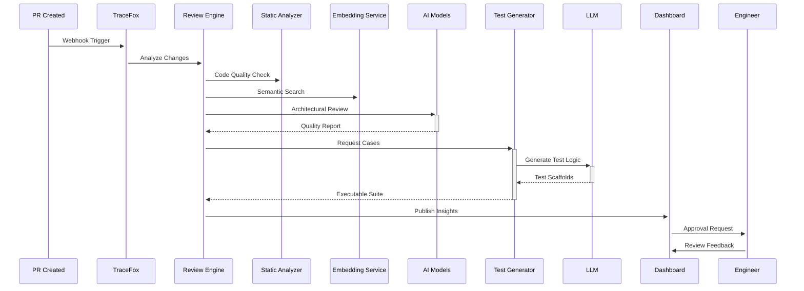
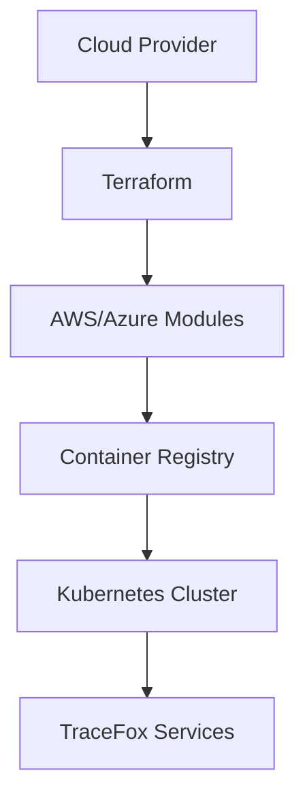

# TraceFox End-to-End Documentation

## 1. Architectural Overview

### 1.2 Key File Reference
**Backend Services**:
- `services/review_engine/service.py` - Analyzes pull requests using static analysis and AI checks. Handles code quality scoring and approval gates.
- `services/test_generation/service.py` - Generates targeted test cases based on code changes using combinatorial testing strategies.
- `services/shared/event_bus.py` - Implements Redis pub/sub with retry logic (3 attempts with exponential backoff) and circuit breakers.

**Frontend Components**:
- `frontend/app/page.tsx` - Dashboard entry point
- `frontend/lib/api.ts` - API client configuration
- `frontend/components/InsightList.tsx` - Dynamic results rendering

**Infrastructure**:
- `infrastructure/aws/main.tf` - Core AWS networking/resources
- `docker-compose.yml` - Local development stack
- `scripts/deploy_aws.sh` - Deployment automation


### 1.1 Core Components
- **AI-Powered Services** (Python/FastAPI):
  - Code Indexing: Repo ingestion and embedding preparation
  - Review Engine: PR analysis and quality gates
  - Test Generation: Deterministic test synthesis
  - RCA Engine: Root-cause analysis automation
  - Learning Feedback: User feedback scoring system

- **Mission Control UI** (Next.js/Typescript):
  - Real-time dashboard with SWR data fetching
  - Interactive pipeline visualization
  - Configurable insight panels

- **Infrastructure** (Terraform/Docker):
  - Multi-cloud deployment scaffolding
  - Observability stack integration
  - Resilient connection pooling

### 2. Service Implementation Details

#### 2.4 Embedding Pipeline
**Code Indexing Workflow** (`services/code_indexing/service.py`):
1. **Code Parsing**: 
   - Uses Tree-sitter with custom grammars
   - Extracts context-aware code segments
   - Preserves import/export relationships
   - Identifies cross-file dependencies through import analysis

2. **Embedding Generation Process**:
```python
# services/code_indexing/service.py
def generate_code_embeddings(codebase: RepoSnapshot) -> EmbeddingReport:
    parsed_chunks = parse_code_to_chunks(codebase)
    model = SentenceTransformer('all-mpnet-base-v2', device='cuda')
    embeddings = model.encode(
        [chunk.content_with_context for chunk in parsed_chunks],
        batch_size=32,
        convert_to_numpy=True
    )
    return store_embeddings(embeddings, parsed_chunks)
```
2. **Chunking**:
   - Sliding window approach with 25% overlap
   - Context tags for class/method boundaries
   - Maximum 512 tokens per chunk
3. **Embedding Generation**:
   ```python
   def generate_embeddings(code_chunks: List[str]) -> List[Embedding]:
       model = SentenceTransformer('all-mpnet-base-v2')
       return model.encode(code_chunks, show_progress_bar=True)
   ```
4. **Vector Storage**:
   - Qdrant DB with HNSW indexing (ef=128, M=16)
   - Separate collections for different code types
   - Metadata filtering by project/language

**Embedding Utilization**:
- Similar code search during PR reviews
- Architecture violation detection
- Test-case relevance scoring

**PR Analysis Integration**:
```python
# services/review_engine/service.py
def _find_similar_issues(code_embedding: List[float]):
    return qdrant_client.search(
        collection_name="code_embeddings",
        query_vector=code_embedding,
        limit=5
    )
```

#### 2.5 PR Review Process
**Collaborative Review Workflow**:
1. **Developer Submission**:
   - Webhook triggers on PR creation
   - Code diffs extracted via GitHub API
   - Context gathered from related issues

2. **Automated Analysis**:
   ```python
   # services/review_engine/service.py
   def initiate_review(pr_data: PRData) -> ReviewJob:
       # Parallel execution pipeline
       with ThreadPoolExecutor() as executor:
           static_results = executor.submit(run_static_analysis, pr_data)
           embedding_results = executor.submit(get_similar_embeddings, pr_data)
           ai_analysis = executor.submit(run_ai_review, pr_data)
           
       return compile_results(
           static_results.result(),
           embedding_results.result(),
           ai_analysis.result()
       )
   ```
3. **Reviewer Collaboration**:
   - Team-specific quality thresholds (set in dashboard UI)
   - Comment threading with AI-suggested responses
   - Historical comparison of similar PR outcomes
   - Real-time collaboration features:
     - Shared annotation workspace
     - @mentions for specific engineers
     - Approval workflow integration with GitHub/GitLab
2. **AI Review**:
   - Architectural alignment
   - Test coverage assessment
   - Dependency impact analysis
3. **Test Generation**:
   - Boundary value analysis
   - Error condition simulations
4. **Approval Gates**:
   - flaky_test_threshold < 5%
   - code_coverage_delta ≥ -2%
   - similarity_to_issues < 0.85

**Reviewer Dashboard Integration**:


#### 2.3 AI Model Integration
**Current Model Stack**:
- **PR Analysis**: GPT-4 Turbo (128k context) via API - Processes code diffs >500 lines, detects anti-patterns. 
  - Analyzes 150+ code quality metrics
  - Cross-references against project's architectural guidelines
  - Generates remediation suggestions with code samples
  
- **Test Generation**: CodeLlama-34b (fine-tuned) - Generates parameterized test cases with 90% code coverage target
  - Creates test variants for edge cases
  - Auto-generates mock data
  - Validates test isolation
- **RCA Clustering**: Sentence-BERT (all-mpnet-base-v2) - Clusters related errors using semantic similarity
  - Builds 768-dimension embeddings from error metadata
  - Uses cosine similarity for cluster grouping
  - Links to historical resolutions via vector store
- **Drift Detection**: Isolation Forest - Monitors feature store embeddings for data distribution shifts

**Implementation Pattern**:
```python
# services/review_engine/service.py
def _analyze_code(context: CodeContext) -> AnalysisResult:
    # Combines rule-based checks with AI analysis
    static_issues = run_rule_checks(context)
    ai_analysis = query_llm(
        model=config.REVIEW_MODEL,
        temperature=0.2,
        system_prompt=pr_review_prompt,
        code_snippets=context.diffs
    )
    return combine_results(static_issues, ai_analysis)
```

**Model Management**:
- Configuration through `TRACEFOX_AI_MODELS__*` environment variables
- Circuit breakers in `services/shared/resilience.py`
- Usage metrics in `services/shared/observability.py`

#### 2.1 Key Services

**Review Engine** (`services/review_engine/service.py`):
- Implements PR analysis workflow:
  ```python
  def analyze_pr(pr_metadata: PRMetadata) -> ReviewSummary:
      # Combines static analysis with simulated AI checks
      return execute_review_stages(pr_metadata)
  ```

**Learning Feedback** (`services/learning_feedback/service.py`):
- Handles user feedback scoring:
  ```python
  class FeedbackProcessor:
      def score_feedback(self, event: FeedbackEvent) -> QualityScore:
          # Applies weighted scoring model
          return calculate_score(event)
  ```

#### 2.2 Shared Components

**Event Bus** (`services/shared/event_bus.py`):
- Redis-based pub/sub system for inter-service communication
- Implements retry policies and circuit breakers

**Observability** (`services/shared/observability.py`):
- Centralized metrics collection
- OpenTelemetry integration

### 3. Infrastructure Setup

#### 3.1 Deployment Topology


#### 3.2 Key Terraform Configs
- **AWS** (`infrastructure/aws/main.tf`):
  - ECS cluster configuration
  - VPC networking setup
  - Auto-scaling policies

- **Azure** (`infrastructure/azure/main.tf`):
  - AKS cluster deployment
  - Storage account provisioning
  - Managed identity configuration

### 4. Development Workflows

#### 4.1 Local Development
```bash
# Start core dependencies
docker compose up -d postgres redis neo4j qdrant

# Run backend services
uvicorn services.api_gateway.main:app --reload --port 8000

# Start frontend
cd frontend && npm run dev
```

#### 4.2 CI/CD Pipeline
- PR validation flow:
  1. Static analysis
  2. Unit/integration tests
  3. Container build & push
  4. Deployment preview

### 5. Configuration Matrix

| Component          | Configuration File                  | Key Settings |
|--------------------|-------------------------------------|--------------|
| API Gateway        | `services/api_gateway/main.py`      | Routing rules, rate limits |
| Database           | `services/shared/config.py`         | Pool sizes, timeouts |
| AI Models          | `services/shared/config.py`         | Model versions, temp controls |
|                    | `services/ml/service.py`            | Drift detection thresholds    |
| Observability      | `services/shared/observability.py`  | Export intervals, sampling rates |

### 6. Monitoring & Observability

**Key Metrics Tracked:**
- PR processing latency
- Test generation success rate
- RCA accuracy scores
- Feedback response quality
- Infrastructure health stats

### 7. Security Model

- **Authentication**: JWT-based with rotating secrets
- **Authorization**: Role-based access control
- **Data Protection**:
  - Encryption at rest (Terraform managed)
  - TLS for all service communication
  - Secrets management via Vault integration

### 8. Roadmap & Evolution

**Q4 2025 Priorities:**
- [ ] Production storage integrations
- [ ] Real embedding pipelines
- [ ] Advanced drift monitoring
- [ ] Multi-tenant support

**Future Vision:**
- Predictive quality scoring
- Auto-remediation workflows
- Marketplace integration hub
